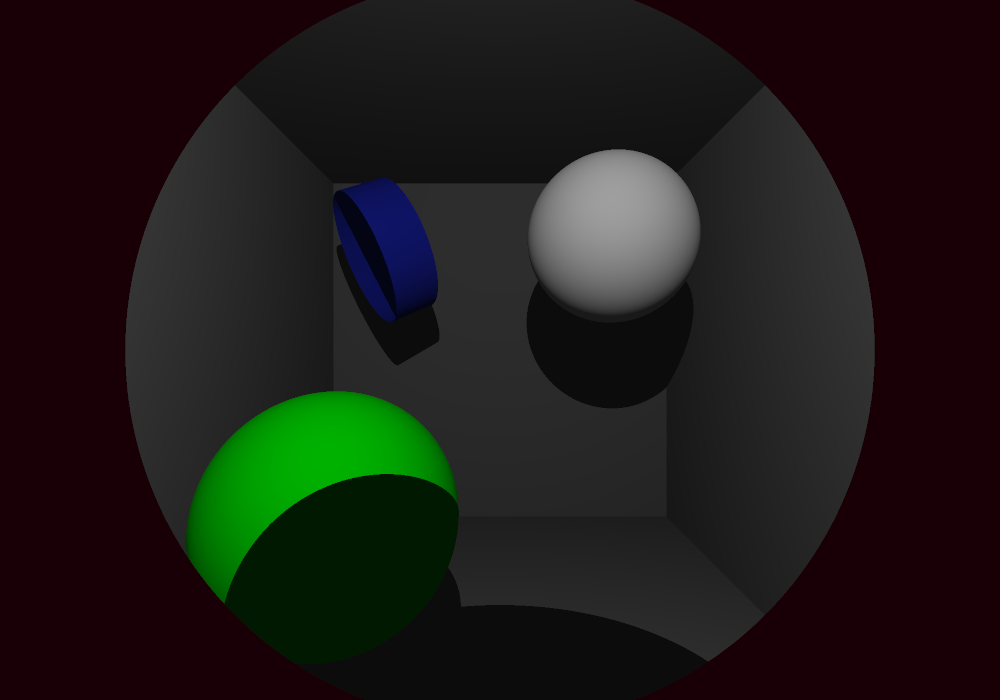
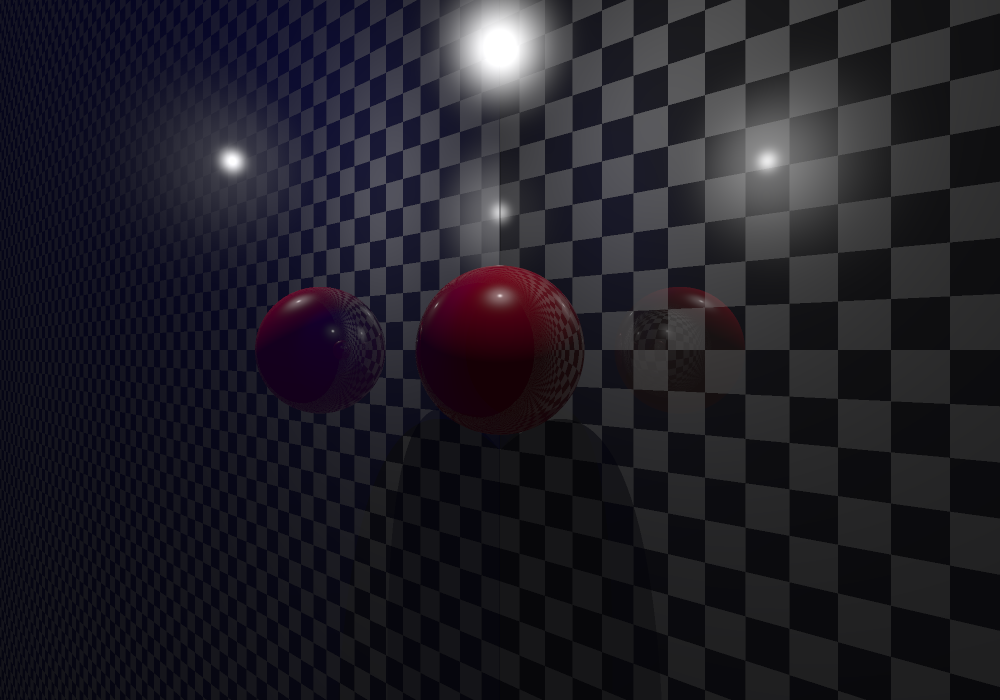
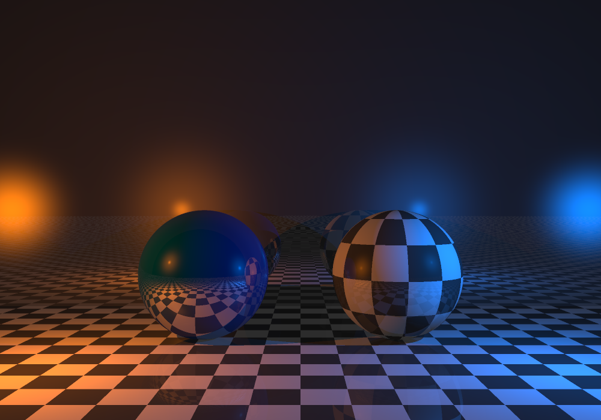
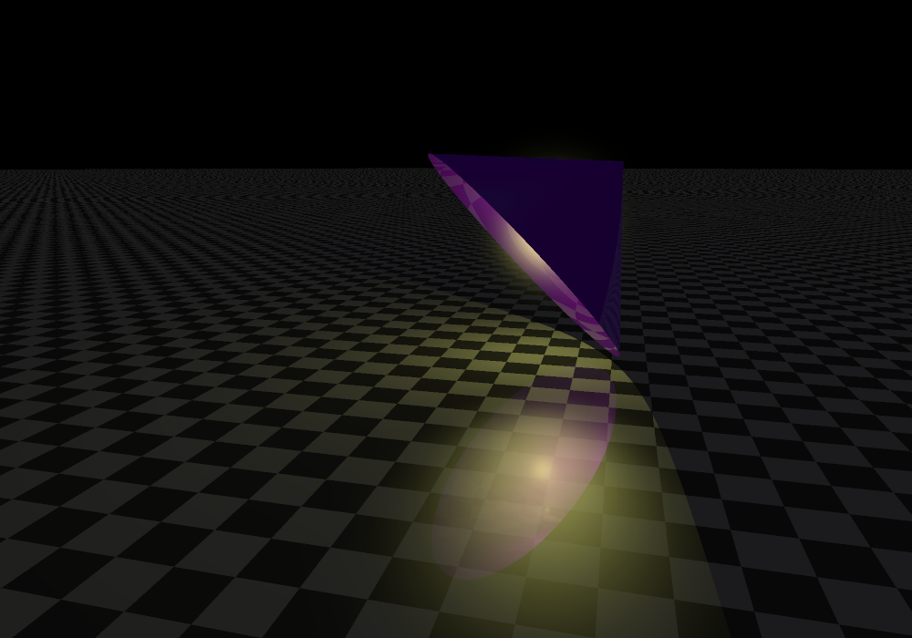

## About
_miniRT_ is a simple Ray Tracer implemented C.  
It it a school project of 19 School, that I worked on with Xavier Le Boulengé.  
This is my personal fork.  

Key features include:
* support for multiple, colored, punctual light sources
* ambient + diffuse + specular shading
* mirror-like reflections
* bump mapping

## Gallery

## A Note about mlx
_mlx_ (short for _minilibX_) is a Graphics/Events Library that provides simple C binding
for interacting with the X window system.  
It is provided to students of the 42 network and is typically the only external library
allowed for Graphical/event-driven projects.  
For convenience reasons a copy of its source has been copied inside this repo
but I obviously **don't own any of it**.

## Build
On Unix systems, just 
`make`.
Windows not supported.

## Run
Use:  
`path/to/miniRT <scene_file>`

The scene will eventually be rendered, you might need to wait up to 20 seconds-ish.

Once launched the program has a shell with which you can move or transform objects
in the scene, or the change the point of view, etc. A full list of commands is provided
[here](doc.txt)

## Scene File Syntax
You can find example scene files [here](scenes).

The syntax is as follows:
* 1 declaration per line
* optional arguments are in brackets ([]), but they are positional so if you want to specify
a specific argument you also to specify all those that precede it.
* comments start with `#` **at the beginning of the line**
* when specifying points the format is x,y,z with **no whitespace** around the commas
* colors are r,g,b using ints in [0, 255]

Declaration can be one of:

#### Camera declaration (exactly 1 required):  
`C <pos> <direction> <fov-in-degrees>`
* `<direction>` must be a vector with a norm of 1

#### Ambient Light declaration (exactly 1 required) :  
`A <intensity> <color>`
* `<intensity>` in [0.0, 1.0]

#### Light declarations :  
`L <pos> <intensity> <color> [not-visible]`
* `<intensity>` can be any positive float.
	*  It represents the distance at which objects hit straight-on by the light
have 100% of their color.
* `<not-visible>` : 0 or 1, if 1 the light source itself won't be visible. (default 0)

#### Shape declarations :  
`<shape-type> <shape-specific-args> <color> [<diff-coef> <spec-coef> <refl-coef> <checker> <bump-map> <bump-map-height>]`
* You can use the coefs to give a different feel to the material of the shape.
* All coef between 0 and 1 (sum must be < 1).
* `<diff-coef>` : proportion of the light reflected diffusely
	* You can think of diff-coef being 0.5 as meaning the same thing as having
the color be half as dark. (default 1)
* `<spec-coef>` : proportion of the light reflected specularly (white spots) (default 0)
* `<refl-coef>` : proportion of the light reflected in a mirror-like way. (default 0)
* `<checker>` : 0 or 1, if 1 the shape's surface is checkered. (default 0)
* `<bump-map>` : greyscale .xpm file representing heights to "paste" on a shape
* `<map-height>` : can be any positive float
	*  If map height is X the image will be "pasted" in such a way that there 
is X units of distance between the bottom and top pixels of the map.
Copies of the height map will be tiled over the surface if needed.

Where the `<shape-type> <shape-args>` part is one of:
* `sp 
 <radius>`
* `pl <origin> <normal>`
* `cn <bottom-center> <direction> <diameter> <length>`
* `cy <vertex> <direction> <diameter-at-1-unit-distance> <length>`
